# `sankosniper`: a winning sanko.tv pass sniper

<div align="center">
  
</div>

## Overview

sankosniper is a Web3 automation toolkit designed for monitoring and executing pass trading strategies on the sanko.tv streaming / trading platform. It provides a suite of Python scripts that enable automated transaction monitoring, pass purchasing, and trading activities, as well as configurable take-profit and stop-loss settings.

## Features

### 1. Transaction Monitoring

- Real-time monitoring of pass trading activities
- Tracks transactions across multiple predefined user sets
- Supports multiple blockchain networks (primarily Arbitrum)

### 2. Automated Pass Trading

- Intelligent pass buying strategies based on:
  - Predefined user sets (Legendary, Bullseye, Target twitter accounts with scaling degrees of priority)
  - Dynamic follower count analysis
  - Supply-based trading parameters

### 3. Telegram Integration

- Real-time transaction notifications
- Command-based pass selling functionality
- Detailed transaction logging

### 4. Twitter Follower Analysis

- Fetch and analyze Twitter user follower counts
- Use follower metrics for trading decisions

## Key Components

### Main Scripts

1. `twitter_sniper.py`
   - Core pass sniping logic
   - Automated pass purchasing
   - Transaction filtering and analysis

2. `twitter_sniper_v2.py`
   - Twitter-based follower analysis
   - Enhanced trading strategy with social metrics

3. `telegramMonitorv3.py`
   - Telegram bot integration
   - Transaction monitoring and notifications
   - Remote pass selling commands

### Utility Scripts

- Pass selling scripts for specific accounts
- Transaction logging utilities
- Blacklist management

## Prerequisites

- Python 3.8+
- Web3.py
- Async libraries (asyncio, httpx)
- Telegram Bot API
- Twitter API access

## Configuration

1. Create a `.env` file with the following placeholders:

   ```text
   TELEGRAM_TOKEN=your_telegram_bot_token
   TELEGRAM_CHAT_ID=your_chat_id
   ALCHEMY_API_KEY=your_alchemy_api_key
   ```

2. Ensure `abi.json` is correctly configured for the target contract

## Security Considerations

- Never share your private keys or API tokens
- Use environment variables for sensitive information
- Implement proper access controls

## Disclaimer

This toolkit is for educational purposes. It's long deprecated but may serve as a framework for newer developers looking for onchain opportunities going forward.

## License

[MIT]

## Contributing

Contributions are welcome!

## Acknowledgements

All credit goes to @erc1337-Coffee as he graciously (and patiently) walked me through a friendtech sniper that he built which 100% was the context I needed to see to start conceptualizing MEV frameworks on my own. Cheers.

